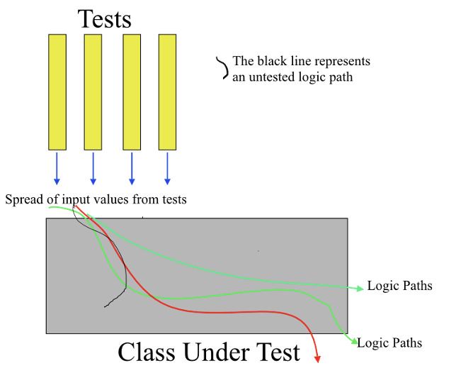
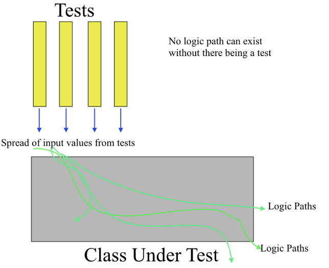

# Scenario — “Deploying an Autonomous Drone Fleet: Code-First vs. Test-First”

## Background

Your company has landed a contract to deliver **50 autonomous delivery drones** for a Smart-City pilot.  
The drones must leave the hub, reach any address within 10 km, drop a 2 kg parcel, and return—**all without human intervention**.

Time-line: **8 weeks** to first public demo.  
Regulators require strict safety checks: collision-avoidance, geofencing, low-battery return, and privacy constraints (no camera when flying over schools).

---

## Approach A — _Code-First (“Build, Then Check”)_

1. **Developers** jump straight into coding the navigation module, motor control, and camera logic.
2. They integrate everything on a full-size drone and run the first end-to-end field test in week 6.
3. The drone lifts off, but:
   - GPS jitter makes the route drift outside the geofence.
   - Low-battery logic cuts in too late—crash landing.
4. Team scrambles: refactor navigation, tune PID loops, add last-minute battery checks, retest under pressure.
5. Demo day: still nervous—only 3 demo flights to “prove” it works.

### 

## Approach B — _Test-First (TDD mindset, Red → Green → Refactor)_

1. **Before** any flight code, engineers write **simulation tests**:

   | Test (Red)                              | Expected “Green” behaviour                          |
   | --------------------------------------- | --------------------------------------------------- |
   | `shouldStayInsideGeofence()`            | Drone x-y never exits 100 m radius in sim.          |
   | `shouldAbortOnLowBattery()`             | If battery < 15 % mid-route, drone returns to hub.  |
   | `shouldPauseCameraOverNo-RecordZones()` | Camera feed flag turns off over school coordinates. |
   | `shouldAvoidMidairCollision()`          | Two path vectors never intersect < 5 m.             |

2. They iterate locally in a physics simulator: **write failing test → minimal code → pass → refactor**.
3. After all unit & integration sim-tests are 🟢, they flash the firmware to the real drone—first outdoor flight is week 3, not week 6.
4. Field anomalies become **new failing sim-tests**; fixes stay deterministic.
5. Demo day: 30 unattended test flights completed; confidence is high.

### 
